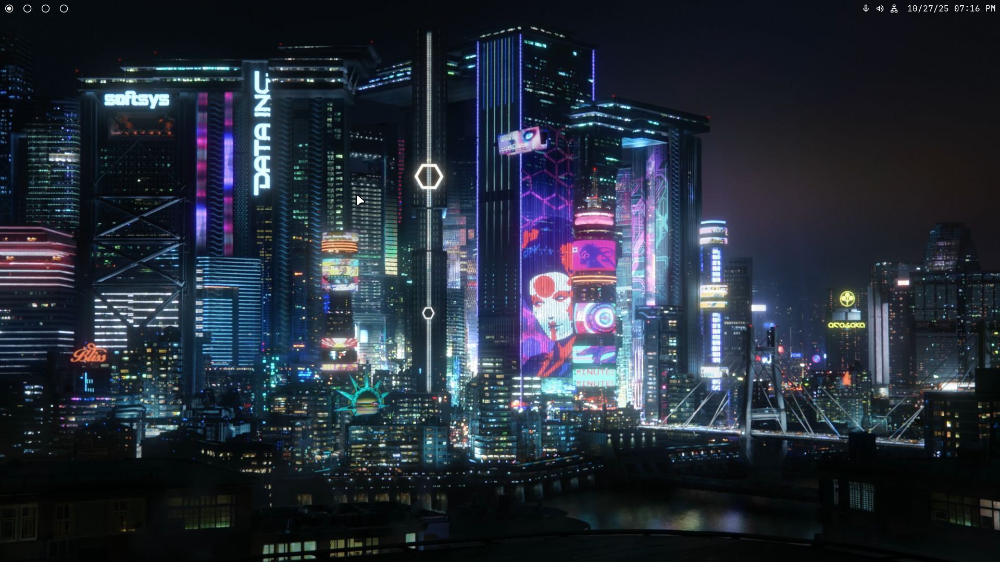

# NixOS Configuration 
My one year old NixOS and home-manager configuration for my desktop and laptop.

## Screenshot



## Software
| Item | Program |
| - | -: |
| Display server | **Wayland** |
| Window Manager | **Sway** |
| Bar | **Waybar** |
| Menu | **wmenu** |
| Terminal | **foot** |
| Browser | **LibreWolf** |
| Editor | **VS Code** |

## Hardware
#### Desktop
- AMD Ryzen 5600x
- NVIDIA 3060
#### Laptop (Thinkpad T480)
- Intel i5-8350U

## Installation

1. Clone repository
```shell
    git clone https://github.com/alexphanna/nixos-config.git
    cd nixos-config
```
2. NixOS rebuild switch
```shell
    sudo nixos-rebuild switch --flake .#desktop
```
or
```shell
    sudo nixos-rebuild switch --flake .#laptop
```

## Credits

- [Frost-Phoenix](https://github.com/Frost-Phoenix/nixos-config): config layout inspiration
- [Rsr45](https://github.com/Rsr45/nixos-config): uBlock Origin config
